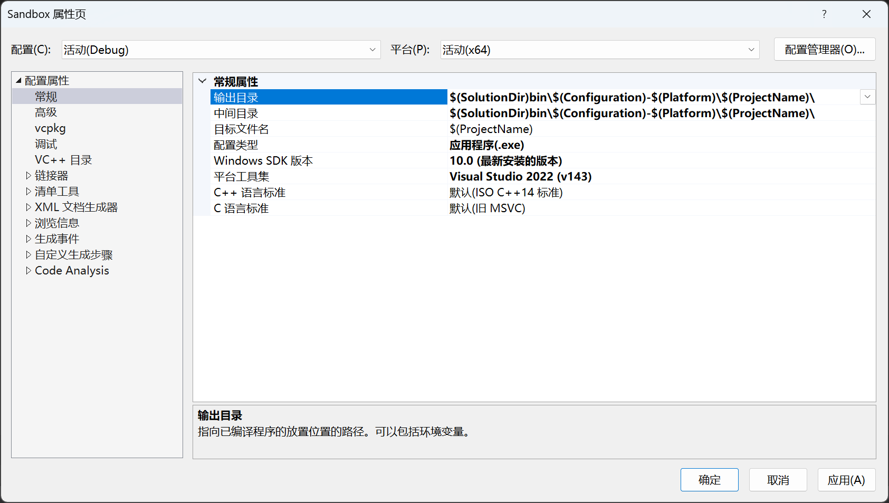
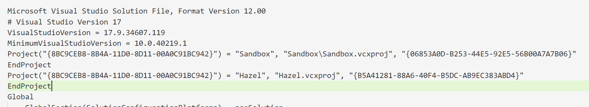

# GameEngine

## Application 
    - 应用层
    - 用于启动游戏，管理游戏的生命周期，处理用户输入，以及渲染游戏画面。
    

## 4.项目设置
### 配置项目属性
1.移除对32位平台的支持
2.设置输出目录为bin目录下，所有exe，dll文件都输出到bin目录下
3.指定生成类型为dll

4.新建项目Sandbox，设置为启动项目

# 项目结构：

Hazel
|-- src
|   |-- Hazel
|   |   |-- Core.h              # Hazel引擎的核心头文件，包含引擎的基本定义和配置
|   |   |-- EntryPoint.h        # 引擎的入口点头文件，包含应用程序的入口点声明
|   |   |-- Application.h       # Application 类的头文件，定义了Hazel应用程序的基本结构
|   |   |-- Application.cpp     # Application 类的实现文件，包含了Hazel应用程序的具体实现
|   |-- Hazel.h                 # Hazel引擎的总头文件，包含了所有Hazel模块的头文件，便于一次性引用整个引擎
