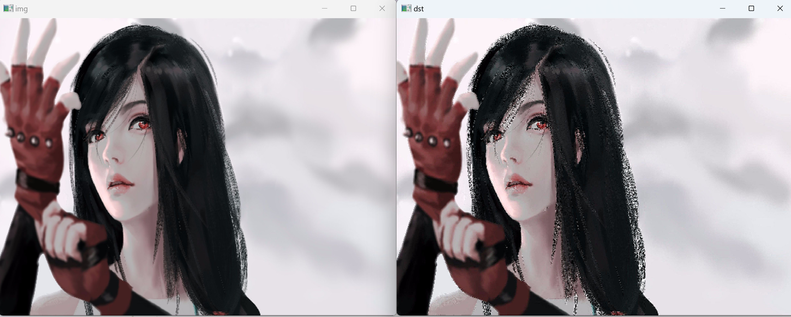

# 1.滤波器
- 滤波器的概念：滤波器是一种用于处理信号的设备，它可以通过增强或者抑制信号的某些特性来改变信号的特性。

# 2.卷积
- 卷积的概念：卷积是一种数学运算，它是一种在两个函数之间产生新函数的方法。在图像处理中，卷积是一种用于图像处理的技术，它可以用于图像的模糊、锐化、边缘检测等操作。
-  卷积核：卷积核是一个矩阵，它是用于卷积运算的核心部分。卷积核的大小和形状可以根据需要进行调整，不同的卷积核可以实现不同的图像处理效果。
- 步长：步长是卷积运算中的一个重要参数，它决定了卷积核在图像上的移动速度。步长越大，卷积核在图像上的移动速度越快，处理速度也越快；步长越小，卷积核在图像上的移动速度越慢，处理速度也越慢。
- 填充：填充是卷积运算中的一个重要参数，它决定了卷积核在图像上的移动范围。填充可以用来调整卷积核在图像上的移动范围，从而实现不同的图像处理效果。
- 卷积操作：就是卷积核按照一定的步长在图像上进行滑动，然后将卷积核与图像上的每一个像素点进行运算，得到新的像素点的值，从而得到新的图像。
- 意义：卷积操作可以用于图像的模糊、锐化、边缘检测等操作，它是图像处理中的一种重要技术。
```python
import cv2
import numpy as np

# 读取图像
img = cv2.imread('test.jpg')

# 定义卷积核
kernel = np.array([[0, -1, 0], [-1, 5, -1], [0, -1, 0]])

# 进行卷积操作
dst = cv2.filter2D(img, -1, kernel)

# 显示图像
cv2.imshow('img', img)
cv2.imshow('dst', dst)
cv2.waitKey(0)
cv2.destroyAllWindows()
```



# 3.均值滤波和方盒滤波
- 均值滤波：均值滤波的原理是将图像中的每一个像素点的值替换为其周围像素点的平均值。
`blur = cv2.blur(img, (5, 5))`
    - img: 输入图像
    - (5, 5): 卷积核的大小
    - blur: 输出图像

- 方盒滤波：方盒滤波的原理是将图像中的每一个像素点的值替换为其周围像素点的加权平均值。
`box = cv2.boxFilter(img, -1, (5, 5))`
    - img: 输入图像
    - -1: 输出图像的深度，-1表示与输入图像相同
    - (5, 5): 卷积核的大小
    - box: 输出图像
- 意义：均值滤波和方盒滤波都是图像处理中常用的滤波方法，它们可以用于图像的模糊、去噪等操作。

```python
import cv2

# 读取图像
img = cv2.imread('test.jpg')

# 进行均值滤波
dst = cv2.blur(img, (5, 5))

# 显示图像
cv2.imshow('img', img)
cv2.imshow('dst', dst)
cv2.waitKey(0)
cv2.destroyAllWindows()
```


# 4.高斯滤波
- 高斯滤波：高斯滤波是一种图像处理中常用的滤波方法，它可以用于图像的模糊、去噪等操作。高斯滤波的原理是将图像中的每一个像素点的值替换为其周围像素点的加权平均值，其中加权系数是根据高斯分布来计算的。
- 意义：高斯滤波是图像处理中常用的滤波方法，它可以用于图像的模糊、去噪等操作。
```python