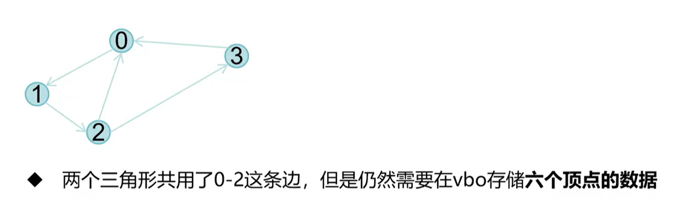
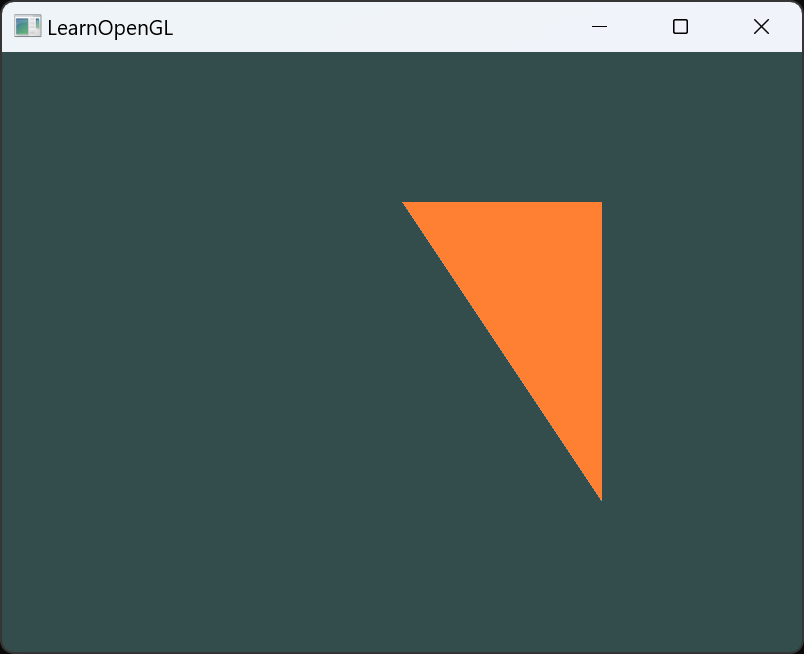

# 1.提出问题

- 对于绘制三角形Strip，Fan模式都不常用，因为太死板
- 纯GL_TRIANGLES无法复用顶点



# 2.顶点索引
 - 顶点索引（index）：使用索引来指定顶点的顺序，从而复用顶点。用来描述一个三角形使用哪几个顶点数据的数据序列。

# 3.EBO
- EBO（Element Buffer Object）：索引缓冲对象，用来存储索引数据的缓冲对象。

## 3.1 EBO创建
```c
unsigned int indices[] = {
    0, 1, 3,
    1, 2, 3
};

GLuint EBO = 0;
glGenBuffers(1, &EBO);
glBindBuffer(GL_ELEMENT_ARRAY_BUFFER, EBO); // 绑定EBO到GL_ELEMENT_ARRAY_BUFFER
glBufferData(GL_ELEMENT_ARRAY_BUFFER, sizeof(indices), indices, GL_STATIC_DRAW);    // 将索引数据复制到缓冲中
```
```c

void perpareVAO()
{
	//1.准备positions
	float positions[] = {
		-0.5f, -0.5f, 0.0f,	
		0.5f, -0.5f, 0.0f,	
		0.0f,  0.5f, 0.0f,	
		0.5f,  0.5f, 0.0f,	
		0.8f, 0.8f, 0.0f,
		0.8f, 0.0f, 0.0f,
	};

	//2.准备索引数据
	unsigned int indices[] = {
		0, 1, 2,	//第一个三角形
		1, 2, 3,	//第二个三角形
		2, 3, 4,	//第三个三角形
		3, 4, 5,	//第四个三角形
	};

	//3.准备VBO
	GLuint positionsVBO = 0;
	GL_CALL(glGenBuffers(1, &positionsVBO));
	GL_CALL(glBindBuffer(GL_ARRAY_BUFFER, positionsVBO));
	GL_CALL(glBufferData(GL_ARRAY_BUFFER, sizeof(positions), positions, GL_STATIC_DRAW));

	//4.准备EBO
	GLuint ebo = 0;
	GL_CALL(glGenBuffers(1, &ebo));
	GL_CALL(glBindBuffer(GL_ELEMENT_ARRAY_BUFFER, ebo));
	GL_CALL(glBufferData(GL_ELEMENT_ARRAY_BUFFER, sizeof(indices), indices, GL_STATIC_DRAW));

	//5.准备VAO
	GL_CALL(glGenVertexArrays(1, &vao));
	GL_CALL(glBindVertexArray(vao));

	//6.绑定VBO，EBO，加入属性描述信息
	GL_CALL(glBindBuffer(GL_ARRAY_BUFFER, positionsVBO));	//此处可以省略
	GL_CALL(glEnableVertexAttribArray(0));	//启用VAO的零号顶点属性位置
	GL_CALL(glVertexAttribPointer(0, 3, GL_FLOAT, GL_FALSE, 3 * sizeof(float), (void*)0));	//设置顶点属性指针

	GL_CALL(glBindBuffer(GL_ELEMENT_ARRAY_BUFFER, ebo));	//EBO加入VAO

	//7.解绑VAO
	GL_CALL(glBindVertexArray(0));
}
```

# 4.索引绘制函数
`glDrawElements(mode, count, type, indices);`
- mode：绘制模式
- count：绘制的索引数量
- type：索引的类型
- indices：索引数组的偏移量
    - 如果使用了EBO，最后一个参数可以是0，如果不写0，表示索引数组的偏移量
    - 如果没有使用EBO，最后一个参数是索引数组的地址


```c
	//GL_CALL(glDrawElements(GL_TRIANGLES, 12, GL_UNSIGNED_INT, 0));
	GL_CALL(glDrawElements(GL_TRIANGLES, 3, GL_UNSIGNED_INT, (void*)(sizeof(int)*3)));
```

