# glfw工程搭建

## 1.CMakeLists.txt

```cmake
# CMake 最低版本号要求
cmake_minimum_required(VERSION 3.12)

#本工程的名字
project(OpenGL_stu01)

# 本工程支持的C++版本	
set(CMAKE_CXX_STANDARD 17)

# 包含头文件目录
include_directories(
	SYSTEM ${CMAKE_CURRENT_SOURCE_DIR}/thirdParty/include
)

# 包含库文件目录
link_directories(
	${CMAKE_CURRENT_SOURCE_DIR}/thirdParty/lib
)

# 为本工程所有cpp文件编译链接生成可执行文件
add_executable(OpenGL_stu01 main.cpp)

#链接库
target_link_libraries(OpenGL_stu01
					  glfw3.lib)


```

## 2.添加glfw库
 - 新建文件夹thirdParty
 将需要的库拷贝到thirdParty文件夹下

 - 将之前编译好的glfw库拷贝到thirdParty文件夹下
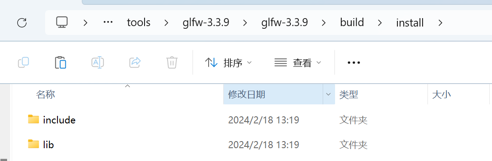

- 头文件拷贝到thirdParty/include文件夹下
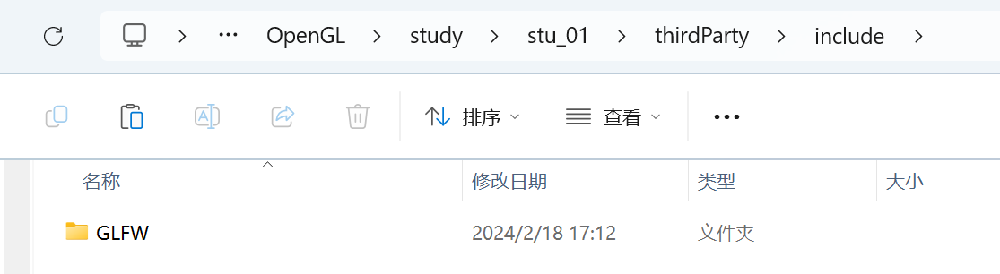

- 库文件拷贝到thirdParty/lib文件夹下
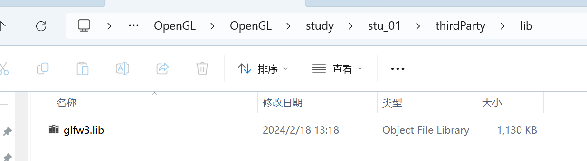

- 初步搭建时的文件结构如下
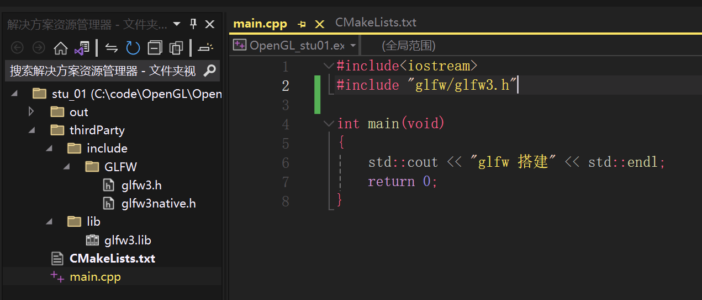


## 3.配置GLAD
GLAD是一个用来管理OpenGL函数指针的库，我们需要使用它来加载OpenGL函数指针。GLAD的官方网站是[https://glad.dav1d.de/](https://glad.dav1d.de/)。我们需要在这个网站上配置GLAD，然后下载GLAD的源代码。
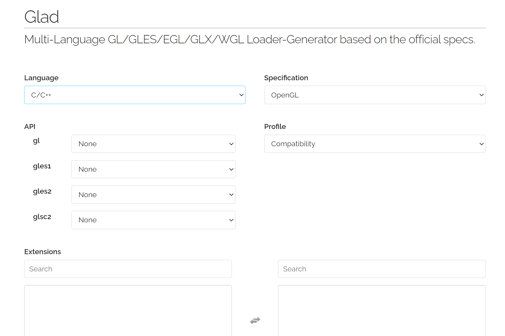

 + 配置GLAD的时候，需要选择OpenGL的版本，以及所需要的扩展。我们选择OpenGL的版本为4.6，然后勾选所有的扩展。最后点击生成按钮，GLAD会生成一个zip文件，我们将这个zip文件解压到thirdParty文件夹下。
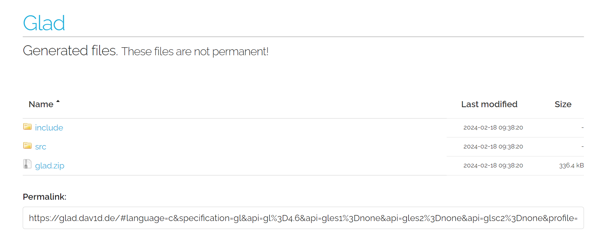

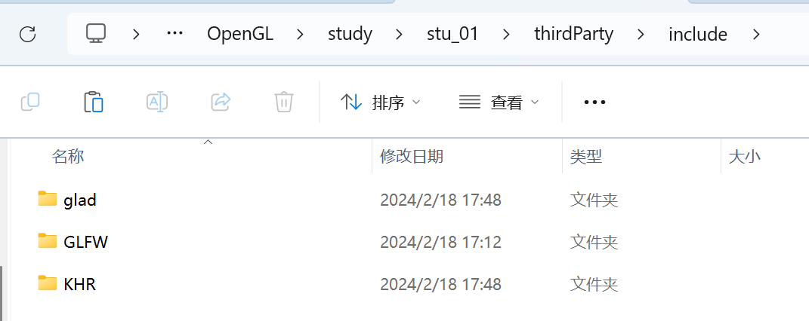

将glad.c文件直接放到main.cpp同级目录下
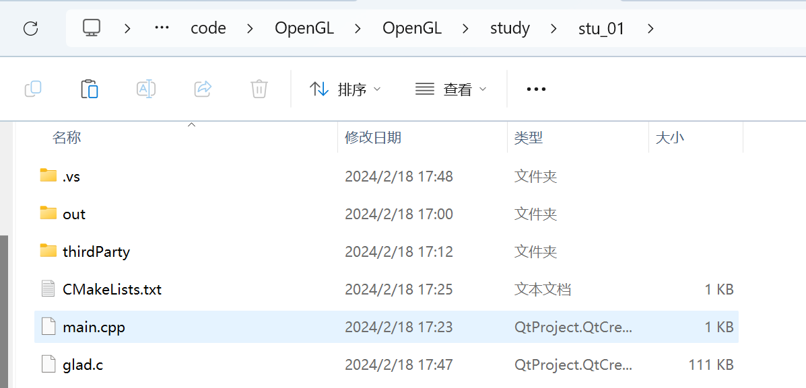

并更改cmake


## 4. 创建窗体
创建窗体的过程：
### 4.1 初始化GLFW的基本环境
```c

glfwInit();		

glfwWindowHint(GLFW_CONTEXT_VERSION_MAJOR, 4);	//主版本号
glfwWindowHint(GLFW_CONTEXT_VERSION_MINOR, 6);	//次版本号
//以上两行代码是告诉GLFW我们要使用的OpenGL版本是4.6

glfwWindowHint(GLFW_OPENGL_PROFILE, GLFW_OPENGL_CORE_PROFILE);	//核心模式

```

### 4.2 创建窗体对象
```c
GLFWwindow* window = glfwCreateWindow(800, 600, "LearnOpenGL", NULL, NULL);	//创建窗体，参数：宽、高、标题、不使用全屏、不共享其他窗体的上下文

if (window == NULL)	//判断窗体是否创建成功
{
	std::cout << "Failed to create GLFW window" << std::endl;
	glfwTerminate();	//释放GLFW分配的资源
	return -1;
}
glfwMakeContextCurrent(window);	//将当前窗体设为OpenGL绘制的舞台：将窗体的上下文设置为当前上下文
```

### 4.3 执行窗体循环
```c
while (!glfwWindowShouldClose(window))	//判断窗体是否应该关闭
{
	glfwSwapBuffers(window);	//交换颜色缓冲
	glfwPollEvents();	//接受并分发窗体消息，检查有没有触发什么事件（键盘输入、鼠标移动等）
}

glfwTerminate();	//释放GLFW分配的资源，用于退出程序
```

### 4.4 完整代码
```c
#include<iostream>

//注意：glad需要在glfw之前包含，因为glad包含了OpenGL的头文件，而glfw只是一个库
#include "glad/glad.h"
#include "glfw/glfw3.h"


/*
	创建glfw窗体系统
*/

int main(void)
{
	std::cout << "glfw 搭建" << std::endl;

//1.初始化GLFW的基本环境
	glfwInit();

	//设置GLFW的配置项,这里是设置OpenGL的版本为4.6,使用核心模式
	glfwWindowHint(GLFW_CONTEXT_VERSION_MAJOR, 4);
	glfwWindowHint(GLFW_CONTEXT_VERSION_MINOR, 6);
	glfwWindowHint(GLFW_OPENGL_PROFILE, GLFW_OPENGL_CORE_PROFILE);


//2.创建窗体对象
	GLFWwindow* window = glfwCreateWindow(800, 600, "LearnOpenGL", NULL, NULL);	//创建一个窗体对象
	if (window == NULL)
	{
		std::cout << "Failed to create GLFW window" << std::endl;
		glfwTerminate();	//终止glfw
		return -1;
	}
	glfwMakeContextCurrent(window);	//将窗体的上下文设置为OpenGL的当前上下文

//3.执行窗体循环
	while (!glfwWindowShouldClose(window))	//循环条件，判断窗体是否关闭
	{
		glfwSwapBuffers(window);			//交换颜色缓冲
		glfwPollEvents();					//检查是否有触发事件
	}


//4.退出前，释放资源
	glfwTerminate();	//终止glfw

	return 0;
}
```
执行结果：
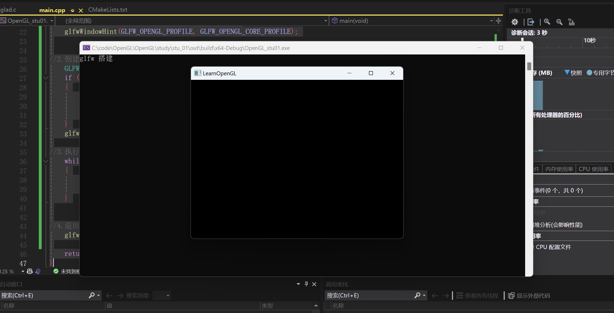
得到一个LearnOpenGL的窗体


## 5. 事件回调函数
### 5.1 加入窗口尺寸改变的回调函数
```c
void framebuffer_size_callback(GLFWwindow* window, int width, int height)
{
	//响应窗口尺寸改变的回调函数
	glViewport(0, 0, width, height);
}
```
加入监听设置
```c
glfwSetFramebufferSizeCallback(window, framebuffer_size_callback);
```


```c
//窗体变换的事件回调函数
void frameBufferSizeCallback(GLFWwindow* window, int width, int height)
{
	std::cout << "窗体最新大小：width = " << width << ", height = " << height << std::endl;
}


glfwMakeContextCurrent(window);	//将窗体的上下文设置为OpenGL的当前上下文

//设置监听窗体变换的事件回调
glfwSetFramebufferSizeCallback(window, frameBufferSizeCallback);

```

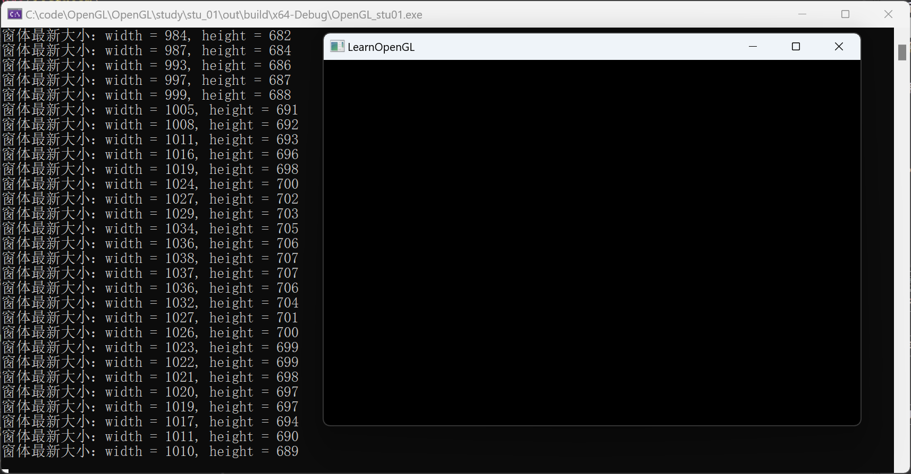


### 5.2 加入键盘输入的回调函数
```c

// 键盘输入的事件回调函数
void keyCallback(GLFWwindow* window, int key, int scancode, int action, int mods)
{
	if (key == GLFW_KEY_W)
	{
		std::cout << "按下了W键" << std::endl;
	}
	else if (key == GLFW_KEY_S)
	{
		std::cout << "按下了S键" << std::endl;
	}
	else if (key == GLFW_KEY_A)
	{
		std::cout << "按下了A键" << std::endl;
	}
	else if (key == GLFW_KEY_D)
	{
		std::cout << "按下了D键" << std::endl;
	}
	else if (key == GLFW_KEY_ESCAPE)
	{
		std::cout << "按下了ESC键" << std::endl;
	}
	else
	{
		std::cout << "按下了其他键" << std::endl;
	}
}
```
加入监听设置
```c
glfwSetKeyCallback(window, key_callback);
```

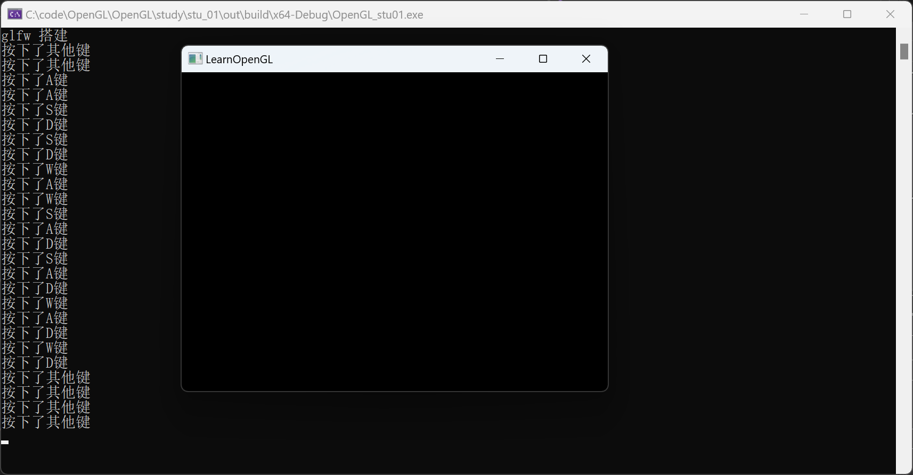