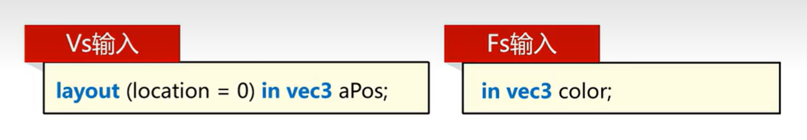
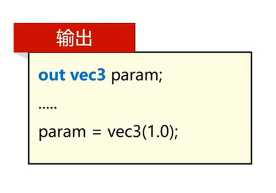

# GLSL语言
 - GLSL是OpenGL的着色器语言，它是一种C语言的变种，专门用于编写OpenGL着色器程序。它包含一些针对向量矩阵运算的特殊语法。
 - 特点
        - 将输入转换为输出的程序
        - 非常独立，彼此间无法进行通信，只能通过输入和输出相互承接

# 数据类型
- 基本数据类型

    | 类型 | 描述 |
    | --- | --- |
    |void|空类型|
    |bool|布尔类型true，false|
    |int|至少16位的整数|
    |float|32位的浮点数|
    |double|64位的浮点数|

- 向量数据类型
    
    | 类型 | 描述 |
    | --- | --- |
    |vecn|n个float组成的向量|
    |bvecn|n个bool组成的向量|
    |ivecn|n个int组成的向量|    
    |uvecn|n个无符号int组成的向量|
    |dvecn|n个double组成的向量|

# 向量使用方式
 - 向量初始化
    ```glsl
    vec3 color0 = vec3(1.0, 0.0, 0.0);
    vec3 color1 = vec3(1.0);    //统一初始化
    ```
- 向量分量使用xyzw或rgba
    ```glsl
    //使用xyzw
    vec4 color0 = vec4(1.0, 0.0, 0.0, 1.0);
    float r = color.x;
    float g = color.y;
    float b = color.z;
    float a = color.w;
    
    //使用rgba
    vec4 color1 = vec4(1.0, 0.0, 0.0, 1.0);
    float r = color.r;
    float g = color.g;
    float b = color.b;
    float a = color.a;
    ```
- 重组（swizzling）
    ```glsl
    vec4 color = vec4(0.8，0.7, 0.6, 1.0);

    vec4 param0 = color.xyzz;   //param0 = (0.8, 0.7, 0.6, 0.6)
    
    vec4 param1 = color.zywx;   //param1 = (0.6, 0.7, 0.8, 1.0)

    vec4 param2 = color.rrrr;   //param2 = (0.8, 0.8, 0.8, 0.8)

    vec4 param3 = param0.xxxx + param1.yyyy;   //param3 = (0.8, 0.7, 0.6, 0.6) + (0.6, 0.6, 0.6, 0.6) = (1.4, 1.3, 1.2, 1.2)
    //大于1.0的部分会被截断，所以param3 = (1.0, 1.0, 1.0, 1.0)

    ```

# Shader变量分类
- 输入变量
    - vs 和 fs 都可以承接上一个步骤的计算结果或者属性输入
    - 通过layout(location = 0)来指定输入变量的位置
    - 通过in关键字来指定输入变量
    

- 输出变量
    - vs  和 fs 都可以向下一个管线步骤输出变量
    - vs向后输出的变量，经过插值后，传递给fs
    - 通过out关键字来指定输出变量
    

- Uniform变量
    - 负责CPU与Shader之间的变量传递（只能从CPU传递到Shader）

# Shader属性变量信息获取
- 输入变量
    - vs当中的输入变量，称为属性变量，是通过VAO描述，从VBO当中读取的顶点属性数据

- 非location属性变量
    - 可以不使用Layout来显性指定输入变量的位置，这时候，OpenGL会自动分配位置

- 通过glGetAttribLocation来获取输入变量的位置,然后通过glVertexAttribPointer来动态指定输入变量的位置
    `GLuint glGetAttribLocation(GLuint program, const char* name);`
    - program：Shader程序对象
    - name：输入变量的名称
    - 返回值：输入变量的位置


