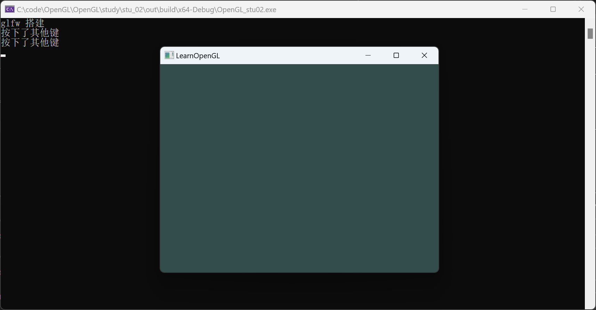

# OpenGL编程

## 1.OpenGL状态机

 - OpenGL运行环境是一个巨大的状态机：一系列变量描述OpenGL此刻应当如何运行。OpenGL状态机可以通过调用OpenGL函数来更改，而且这些函数会立即影响到OpenGL的行为，每一个函数都会改变状态机的状态或者触发其执行某个行为。

- 状态机的概念是OpenGL的核心，这意味着我们可以通过调用OpenGL的函数来更改OpenGL的状态，从而影响OpenGL的输出。例如，我们可以通过调用glClearColor函数来设置清空屏幕所用的颜色，通过调用glClear函数来清空屏幕，通过调用glViewport函数来设置视口的尺寸等等。

- OpenGL的状态机是一个巨大的全局状态，它会影响OpenGL中的所有渲染调用。这也是为什么我们可以在任何地方调用OpenGL函数来更改OpenGL的行为，而不需要传递任何参数。

- 例如，我们可以在程序的任何地方调用glClearColor函数来设置清空屏幕所用的颜色，而这个颜色会一直保留到我们再次调用glClearColor函数为止。同样，我们可以在程序的任何地方调用glClear函数来清空屏幕，而这个清空操作会一直保留到我们再次调用glClear函数为止。

- 什么是状态机：状态机是一种抽象的机器，它可以处于多种状态之一，每一个状态都会触发机器执行不同的行为。OpenGL的状态机是一个巨大的全局状态，它会影响OpenGL中的所有渲染调用。

## 2.OpenGL API
```c
glViewport(GLint x, GLint y, GLsizei width, GLsizei height);
``` 
- 该函数设置了视口的位置和大小，即告诉OpenGL渲染窗口的尺寸大小，即告诉OpenGL可以用来渲染的窗口大小。前两个参数控制窗口左下角的位置，后两个参数控制渲染窗口的宽度和高度（像素）。

```c
glClearColor(GLfloat red, GLfloat green, GLfloat blue, GLfloat alpha);
```
- 该函数设置了清空屏幕所用的颜色，即告诉OpenGL清空屏幕时使用的颜色。这个函数的参数指定了清空屏幕所用的颜色，它是一个RGBA值，每个值的范围都是0.0到1.0。当调用glClear函数时，屏幕的颜色就会被设置为glClearColor函数设置的颜色。

```c
glClear(GLbitfield mask);
```
- 该函数是用来清空屏幕的，它使用glClearColor函数设置的颜色来清空屏幕。它的参数是一个缓冲位，它可以用来指定要清空的缓冲。这里我们传递GL_COLOR_BUFFER_BIT，它表示颜色缓冲。

#### 双缓冲（Double Buffering）
- 双缓冲是一种技术，它消除了绘图时可能出现的闪烁现象。在绘制图像时，我们会在屏幕上立即看到图像的绘制过程，这可能会导致图像在屏幕上闪烁。双缓冲消除了这个问题：所有的绘制操作都是在后台的缓冲区进行的，当所有的绘制操作完成后，我们才将它们一起显示在屏幕上。这可以保证我们在屏幕上看到的图像是完整的。在每一帧绘制任务完成后，需要把后台缓冲区和前台缓冲区进行交换，这样才能在屏幕上看到绘制的图像。

```c
glfwSwapBuffers(window);
```
- 该函数用来交换颜色缓冲，它会交换颜色缓冲，并且将会使用新的颜色缓冲进行绘制。

```c
#include<iostream>

//注意：glad需要在glfw之前包含，因为glad包含了OpenGL的头文件，而glfw只是一个库
#include "glad/glad.h"
#include "glfw/glfw3.h"


/*
	- 使用GLAD加载所有当前版本需要的OpenGL函数指针
	- 查看glad的文档，了解如何使用glad加载OpenGL函数指针
	- 函数练习
	  1.glViewport()函数:设置视口大小
	  2.glClearColor()函数:设置清空屏幕所用的颜色
	  3.glClear()函数:清空屏幕的颜色缓冲
	  4.glfwSwapBuffers()函数:交换颜色缓冲,双缓冲技术
*/

// 窗体变换的事件回调函数
void frameBufferSizeCallback(GLFWwindow* window, int width, int height)
{
	//更新OpenGL视口的大小
    glViewport(0, 0, width, height);
}

// 键盘输入的事件回调函数
void keyCallback(GLFWwindow* window, int key, int scancode, int action, int mods)
{
	if (key == GLFW_KEY_W)
	{
		std::cout << "按下了W键" << std::endl;
	}
	else if (key == GLFW_KEY_S)
	{
		std::cout << "按下了S键" << std::endl;
	}
	else if (key == GLFW_KEY_A)
	{
		std::cout << "按下了A键" << std::endl;
	}
	else if (key == GLFW_KEY_D)
	{
		std::cout << "按下了D键" << std::endl;
	}
	else if (key == GLFW_KEY_ESCAPE)
	{
		std::cout << "按下了ESC键" << std::endl;
	}
	else
	{
		std::cout << "按下了其他键" << std::endl;
	}
}

int main(void)
{
	std::cout << "glfw 搭建" << std::endl;

//1.初始化GLFW的基本环境
	glfwInit();

	//设置GLFW的配置项,这里是设置OpenGL的版本为4.6,使用核心模式
	glfwWindowHint(GLFW_CONTEXT_VERSION_MAJOR, 4);
	glfwWindowHint(GLFW_CONTEXT_VERSION_MINOR, 6);
	glfwWindowHint(GLFW_OPENGL_PROFILE, GLFW_OPENGL_CORE_PROFILE);


//2.创建窗体对象
	GLFWwindow* window = glfwCreateWindow(800, 600, "LearnOpenGL", NULL, NULL);	//创建一个窗体对象
	if (window == NULL)
	{
		std::cout << "Failed to create GLFW window" << std::endl;
		glfwTerminate();	//终止glfw
		return -1;
	}
	glfwMakeContextCurrent(window);	//将窗体的上下文设置为OpenGL的当前上下文

	//监听
	//设置监听窗体变换的事件回调
	glfwSetFramebufferSizeCallback(window, frameBufferSizeCallback);
	//设置监听键盘输入的事件回调
	glfwSetKeyCallback(window, keyCallback);


	//使用GLAD加载所有当前版本需要的OpenGL函数指针
	if (!gladLoadGLLoader((GLADloadproc)glfwGetProcAddress))
	{
		std::cout << "Failed to initialize GLAD" << std::endl;
		return -1;
	}


	//设置OpenGL视口以及清理颜色
	glViewport(0, 0, 800, 600);	//设置视口大小
	glClearColor(0.2f, 0.3f, 0.3f, 1.0f);	//设置清空屏幕所用的颜色,RGBA


//3.执行窗体循环
	while (!glfwWindowShouldClose(window))	//循环条件，判断窗体是否关闭
	{
		glClear(GL_COLOR_BUFFER_BIT);		//清空屏幕的颜色缓冲

		glfwPollEvents();					//检查是否有触发事件

		//渲染操作

		glfwSwapBuffers(window);			//切换双缓冲区


	}


//4.退出前，释放资源
	glfwTerminate();	//终止glfw

	return 0;
}
```




## 3.OpenGL函数错误处理

 - OpenGL不会因为参数错误而报错，它会忽略掉错误的参数并继续执行。这意味着如果我们传递了错误的参数，OpenGL不会报错，而是会继续执行，但是它不会按照我们的预期进行渲染。这就是为什么我们需要检查OpenGL是否发生了错误，以便及时发现错误并进行处理。
 - OpenGL提供了一个函数来检查错误，这个函数就是glGetError函数。这个函数会返回当前的错误信息，如果没有错误发生，它会返回GL_NO_ERROR。我们可以在每次调用OpenGL函数后调用glGetError函数来检查OpenGL是否发生了错误。
 ```c
 glClearColor(0.2f, 0.3f, 0.3f, 1.0f);
GLenum error = glGetError();
if (error != GL_NO_ERROR)
{
    std::cout << "OpenGL发生了错误：" << error << std::endl;
    switch (error)
    {
    case GL_INVALID_ENUM:
        std::cout << "错误类型：GL_INVALID_ENUM" << std::endl;
        break;
    case GL_INVALID_VALUE:
        std::cout << "错误类型：GL_INVALID_VALUE" << std::endl;
        break;
    case GL_INVALID_OPERATION:
        std::cout << "错误类型：GL_INVALID_OPERATION" << std::endl;
        break;
    case GL_STACK_OVERFLOW:
        std::cout << "错误类型：GL_STACK_OVERFLOW" << std::endl;
        break;
    default:
        std::cout << "未知错误类型" << std::endl;
    }
}
```
- glGetError函数会返回当前的错误信息，如果没有错误发生，它会返回GL_NO_ERROR。我们可以在每次调用OpenGL函数后调用glGetError函数来检查OpenGL是否发生了错误。


将错误检查函数封装成一个宏
```c
#pragma once

//预编译宏DEBUG用于控制是否检查错误
#ifdef DEBUG
#define GL_CALL(func) func; checkError()
#else
#define GL_CALL(func) func
#endif // DEBUG

void checkError();
```
```c
#include "checkError.h"

#include "glad/glad.h"

#include<iostream>
#include<string>
#include<assert.h>

//错误检查函数
void checkError()
{
	GLenum errorCode = glGetError();
	std::string errorStr = "";
	if (errorCode != GL_NO_ERROR)
	{
		std::cout << "发生了OpenGL错误，错误码为：" << errorCode << std::endl;
		switch (errorCode)
		{
		case GL_INVALID_ENUM:
			errorStr = "GL_INVALID_ENUM";
			break;

		case GL_INVALID_VALUE:
			errorStr = "GL_INVALID_VALUE";
			break;

		case GL_INVALID_OPERATION:
			errorStr = "GL_INVALID_OPERATION";
			break;

		case GL_STACK_OVERFLOW:
			errorStr = "GL_STACK_OVERFLOW";
			break;

		case GL_STACK_UNDERFLOW:
			errorStr = "GL_STACK_UNDERFLOW";
			break;

		case GL_OUT_OF_MEMORY:
			errorStr = "GL_OUT_OF_MEMORY";
			break;
		default:
			std::cout << "错误类型：未知" << std::endl;
			break;
		}
		std::cout << "错误类型：" << errorStr << std::endl;
		assert(false);	//断言,如果发生错误，程序终止
	}
}
```
```c
//glClear(GL_COLOR_BUFFER_BIT);		//清空屏幕的颜色缓冲
//glClear(-1);	
//checkError();	//错误检查函数
GL_CALL(glClear(-1));
```

```cmake
#向项目中加入一个全局的预编译宏
add_definitions(-DDEBUG)
```

更加高效简洁的错误检查


## 4.封装
OpenGL 的绘制代码会很长，所以需要做一些必要的封装，让代码更加简洁和易读。

==目标==：封装一个Application类，用于管理OpenGL的初始化、窗体的创建、渲染循环的执行、资源的释放等操作。将窗体相关的代码锁在里面，并且暴露必要的接口

==思路==：3D程序都是帧循环驱动，每个对象应该先被初始化，然后每一帧更新数据或者处理事件，推出前释放资源。所以我们可以将这些操作封装成一个类，然后在main函数中调用这个类的方法。

#### 4.1 Application类的设计

单例类设计
Application作为程序的入口，只需要一个实例即可，所以我们可以将Application设计成一个单例类。
通过Application::getInstance()方法获取Application的唯一实例。用静态成员变量保存Application的唯一实例。
```c
class Application
{
public:
	//获取Application的唯一实例
	static Application* getInstance();

	//初始化
	void init();

	//执行
	void run();

	//释放资源
	void release();

private:
	Application() {};	//构造函数私有化
	Application(const Application& app) {};	//拷贝构造函数私有化
	Application& operator=(const Application& app) {};	//赋值运算符重载私有化

	static Application* instance;	//Application的唯一实例
};
```

#### 4.2 Application成员变量的设计
描述窗体的宽度和高度
```c
uint32_t mWidth{ 0 };
uint32_t mHeight{ 0 };
GLFWwindow* mWindow{ nullptr };
```
####4.3 对外接口设计
```c
bool init(const int& width = 800,const int& height = 600);

bool update();

void destroy();

uint32_t getWidth() const { return mWidth; }
uint32_t getHeight() const { return mHeight; }
```


## 5. 事件回调函数
### 5.1 函数指针
- 在C++中，函数指针即存储一个函数所在地址的指针类型。函数指针的声明方式为：返回类型(*指针变量名)(参数列表)。函数指针的赋值方式为：指针变量名 = 函数名。函数指针的调用方式为：(*指针变量名)(参数列表)。
==举例==
using MyFunc = int(*)(int, int);	//定义一个函数指针类型
int add(int a, int b) { return a + b; }	//定义一个函数
MyFunc p = add;	//将函数add的地址赋值给函数指针p
int result = p(1, 2);	//调用函数指针p，执行函数add

总结可以使用函数指针类型变量，作为Application类的成员变量，用于存储回调函数的地址。

---
### 5.2 Resize回调函数
**Application**
1. Application内定义静态函数frameBufferSizeCallback，用于处理窗体变换的事件回调，并设置到GLFW的窗体对象中承接Resize事件。
2.定义Application内的函数指针类型ResizeCallback，用于存储窗体变换的事件回调函数的地址。
3. 定义ResizeCallBack类型的成员变量mResizeCallback，用于存储窗体变换的事件回调函数的地址。
4. 在frameBufferSizeCallback函数中，调用mResizeCallback成员变量，执行窗体变换的事件回调函数。

**main**
1.增加单独的OnResize函数，形式要和ResizeCallback一致。
2.在main函数中，调用Application的setResizeCallback函数，将OnResize函数的地址设置到Application的mResizeCallback成员变量中。

```c
// 窗体变换的事件回调函数
void onResize(GLFWwindow* window, int width, int height)
{
	//更新OpenGL视口的大小
	glViewport(0, 0, width, height);
}
```
```c
using ResizeCallback = void(*)(GLFWwindow*, int, int);
class Application
{
public:
	//设置窗体变换的事件回调
	void setResizeCallback(ResizeCallback callback);

	static void frameBufferSizeCallback(GLFWwindow* window, int width, int height)
	{
		if (mResizeCallback)
		{
			mResizeCallback(window, width, height);
		}
	}

private:
	ResizeCallback mResizeCallback{ nullptr };
};
```

## 5.3 键盘输入的回调函数
步骤：
1. Application内定义静态函数keyCallback，用于处理键盘输入的事件回调，并设置到GLFW的窗体对象中承接键盘输入事件。
2.定义Application内的函数指针类型KeyCallback，用于存储键盘输入的事件回调函数的地址。
3. 定义KeyCallBack类型的成员变量mKeyCallback，用于存储键盘输入的事件回调函数的地址。
4. 在keyCallback函数中，调用mKeyCallback成员变量，执行键盘输入的事件回调函数。

```c
// 键盘输入的事件回调函数

void onKey(GLFWwindow* window, int key, int scancode, int action, int mods)
{
	if (key == GLFW_KEY_W)
	{
		std::cout << "按下了W键" << std::endl;
	}
	else if (key == GLFW_KEY_S)
	{
		std::cout << "按下了S键" << std::endl;
	}
	else if (key == GLFW_KEY_A)
	{
		std::cout << "按下了A键" << std::endl;
	}
	else if (key == GLFW_KEY_D)
	{
		std::cout << "按下了D键" << std::endl;
	}
	else if (key == GLFW_KEY_ESCAPE)
	{
		std::cout << "按下了ESC键" << std::endl;
	}
	else
	{
		std::cout << "按下了其他键" << std::endl;
	}
}
```
```c
using KeyCallback = void(*)(GLFWwindow*, int, int, int, int);
class Application
{
public:
	//设置键盘输入的事件回调
	void setKeyCallback(KeyCallback callback);

	static void keyCallback(GLFWwindow* window, int key, int scancode, int action, int mods)
	{
		if (mKeyCallback)
		{
			mKeyCallback(window, key, scancode, action, mods);
		}
	}

private:

	KeyCallback mKeyCallback{ nullptr };
};
```	

