#1. CPU 与 GPU
 - 图像渲染的本质上，就是CPU端的C++程序控制GPU行为的过程，
   控制过程包括 **数据传输** 与 **指令发送**。

   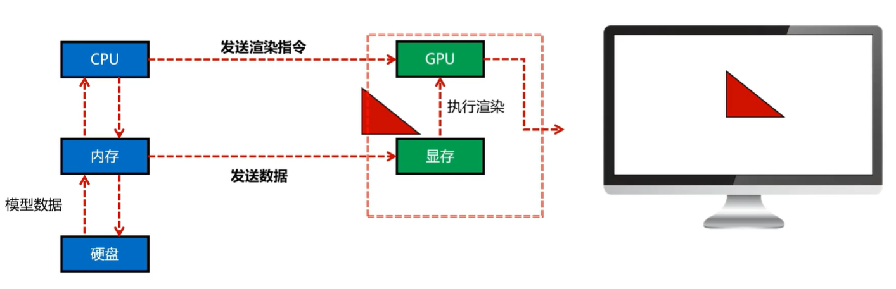

 - 内存和显存之间是有发生数据传输的，这个过程是非常耗时的。
   为了减少这种数据传输的时间，我们需要尽量减少CPU与GPU之间的数据传输。
 
 #### 显卡GPU
    GPU是图形处理器，是一种专门用于处理图形数据的处理器。
    他最强大的功能就是并行计算能力极强

**两大工作**
 - GPU对三角形数据的处理，分为 **顶点处理** 与 **片元处理**
    - 顶点处理：将三角形的顶点数据转换为屏幕上的像素点
    - 片元处理：对每个像素点进行颜色计算

 - 顶点与片元的处理，统一通过着色器来完成，它是我们在编写的运行在GPU端的程序。
 - 着色器是一种运行在GPU上的小程序，它是我们在CPU端编写的，然后传输到GPU端运行的。
  
    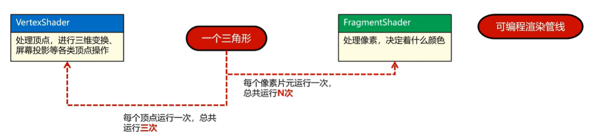

#2. 标准化设备坐标（NDC）

**显示的基础原理**
 - 标准化设坐标（Normalized Device Coordinates，NDC）是OpenGL的一个标准坐标系。
 - 用-1.0到1.0的数字，表示顶点的坐标，本质上就是比例
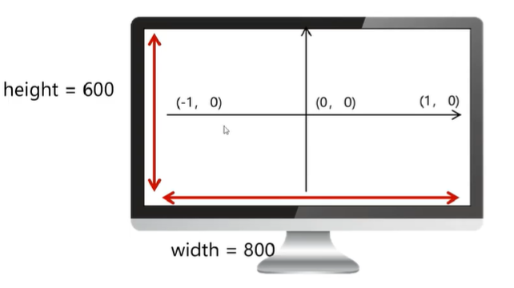

举例 ： （0.3 ，0.2） 在800x600的屏幕上：（400+0.3 * 400, 300+0.2 * 300） = （520, 360）

（-0.4， 0.1） 在800x600的屏幕上：（400-0.4 * 400, 300+0.1 * 300） = （240, 330）

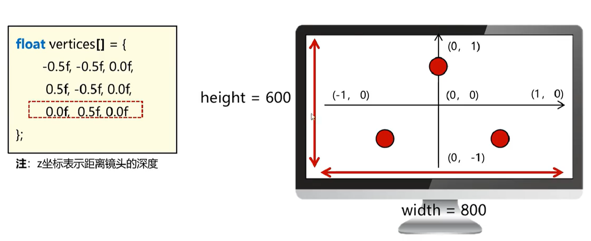
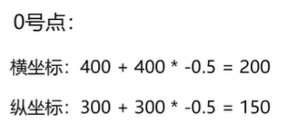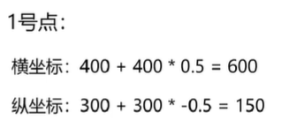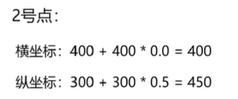
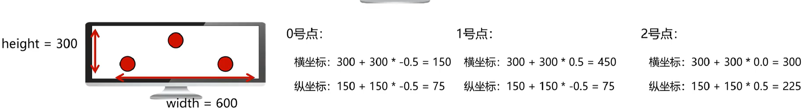

---
# 3. VBO
 **什么是VBO**
 - VBO（Vertex Buffer Object）：表示了在GPU显存上的一段存储空间对象，描述类型的对象

 - VBO在C++中，表现为一个unsigned int 类型的变量，理解为GPU端内存对象的一个ID编号。一个VBO对象，内含一个显存段。
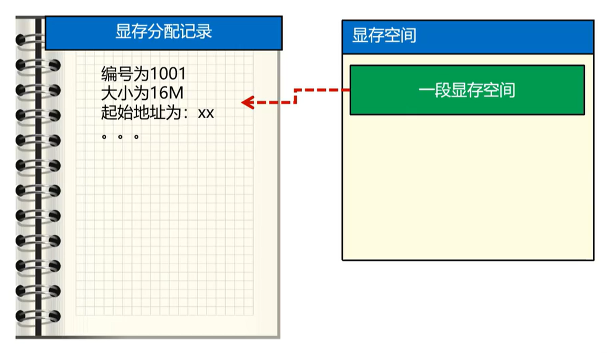

##VBO的使用

###1. 创建VBO对象
`void glGenBuffers(GLsizei n, GLuint *buffers);`
 - n：创建VBO对象的个数
 - buffers：存储创建的VBO对象的ID编号

 此时 还没有分配显存空间，只是创建了一个VBO对象的ID编号
 ```c
 //生成一个顶点缓冲对象，并将其存储在变量VBO中
 GLuint VBO = 0;
 glGenBuffers(1, &VBO);
 ```

 ```c
 //生成3个顶点缓冲对象，并将其存储在变量VBOArray中
 GLuint VBOArray[] = {0, 0, 0};    
 glGenBuffers(3, VBOArray);
```

###2. 销毁VBO对象
`void glDeleteBuffers(GLsizei n, const GLuint *buffers);`
 - n：销毁VBO对象的个数
 - buffers：存储销毁的VBO对象的ID编号

 ```c
 //销毁一个顶点缓冲对象
 glDeleteBuffers(1, &VBO);
 ```

 ```c
 //销毁3个顶点缓冲对象
 glDeleteBuffers(3, VBOArray);
```

###3. VBO绑定+数据更新
- 绑定：将某个资源，与OpenGL的某个状态插槽进行关联
    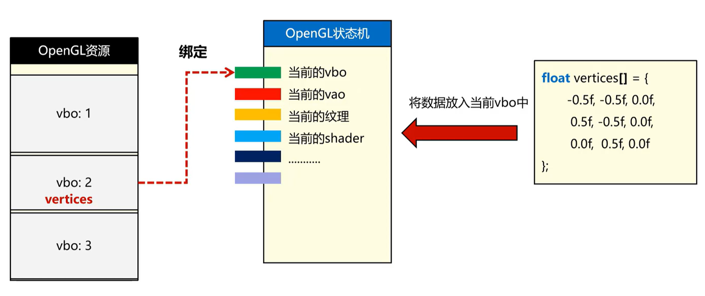

 - VBO的绑定
    `void glBindBuffer(GLenum target, GLuint buffer);`
    - target：把当前的VBO绑定到状态机的哪个插槽上
    - buffer：绑定VBO的编号；0表示不绑定任何buffer

```c
//绑定VBO
glBindBuffer(GL_ARRAY_BUFFER, VBO);
```
- VBO填入数据
    `void glBufferData(GLenum target, GLsizeiptr size, const GLvoid *data, GLenum usage);`
    - target：针对状态机的哪个插槽进行操作
    - size： 装土当前buffer的数据大小
    - data： 装有数据的数组指针
    - usage：数据的使用方式
        - GL_STATIC_DRAW：数据不会或几乎不会改变
        - GL_DYNAMIC_DRAW：数据会被改变很多
        - GL_STREAM_DRAW：数据每次绘制时都会改变

```c
//填充VBO
glBufferData(GL_ARRAY_BUFFER, sizeof(vertices), vertices, GL_STATIC_DRAW);
```

```c
void prepare()
{
	float vertices[] = {
		-0.5f, -0.5f, 0.0f,	//左下角
		0.5f, -0.5f, 0.0f,	//右下角
		0.0f,  0.5f, 0.0f	//顶部
	};

	//1.生成一个vbo
	GLuint vbo = 0;
	GL_CALL(glGenBuffers(1, &vbo));	//生成一个vbo，还没有分配显存

	//2.绑定当前vbo，到OpenGL状态机的当前vbo插槽上
	glBindBuffer(GL_ARRAY_BUFFER, vbo);	//绑定vbo，后续的操作都是基于这个vbo的

	//3.传输数据到vbo，从CPU内存到GPU内存，在开辟显存
	glBufferData(GL_ARRAY_BUFFER, sizeof(vertices), vertices, GL_STATIC_DRAW);	//GL_STATIC_DRAW:数据不会或几乎不会改变
}
```

### 4. 多属性数据
    - 顶点数据中，不仅仅包含位置数据，还包含颜色数据、法线数据等
    - 一个VBO中，可以存储多种属性的数据
    - 一个VBO中，可以存储多个顶点的数据
    
 - 每个属性存储为一个vbo,SingleBuffer策略

```c

void prepareSingleBuffer()
{
	//1.准备顶点位置数据和颜色数据
	float positions[] = {
		-0.5f, -0.5f, 0.0f,
		0.5f, -0.5f, 0.0f,
		0.0f,  0.5f, 0.0f
	};

	float colors[] = {
		1.0f, 0.0f, 0.0f,
		0.0f, 1.0f, 0.0f,
		0.0f, 0.0f, 1.0f
	};


	//2.为位置数据和颜色数据分别创建VBO
	GLuint vboPositions = 0;
	GLuint vboColors = 0;

	GL_CALL(glGenBuffers(1, &vboPositions));
	GL_CALL(glGenBuffers(1, &vboColors));

	//3.给两个分开的vbo各自传输数据
	GL_CALL(glBindBuffer(GL_ARRAY_BUFFER, vboPositions));
	GL_CALL(glBufferData(GL_ARRAY_BUFFER, sizeof(positions), positions, GL_STATIC_DRAW));

	GL_CALL(glBindBuffer(GL_ARRAY_BUFFER, vboColors));
	GL_CALL(glBufferData(GL_ARRAY_BUFFER, sizeof(colors), colors, GL_STATIC_DRAW));
}

```


 - 所有属性存储为一个vbo,InterleavedBuffer策略
```c
//顶点数据
float vertices[] = {
    //位置数据          //颜色数据
    -0.5f, -0.5f, 0.0f, 1.0f, 0.0f, 0.0f,	//左下角
    0.5f, -0.5f, 0.0f, 0.0f, 1.0f, 0.0f,	//右下角
    0.0f,  0.5f, 0.0f, 0.0f, 0.0f, 1.0f	//顶部
};

//1.生成一个vbo
GLuint vbo = 0;
GL_CALL(glGenBuffers(1, &vbo));	//生成一个vbo，还没有分配显存

//2.绑定当前vbo，到OpenGL状态机的当前vbo插槽上
GL_CALL(glBindBuffer(GL_ARRAY_BUFFER, vbo));	//绑定vbo，后续的操作都是基于这个vbo的

//3.传输数据到vbo，从CPU内存到GPU内存，在开辟显存
GL_CALL(glBufferData(GL_ARRAY_BUFFER, sizeof(vertices), vertices, GL_STATIC_DRAW);	//GL_STATIC_DRAW:数据不会或几乎不会改变.

```

---

# 6. VAO
**什么是VAO**
 - 描述结构： 在图形学编程中，对于一组纯粹的数据，我们可以使用VBO来描述这组数据，但是VBO只能描述数据，不能描述数据的结构。

 - VAO（Vertex Array Object）：顶点数组对象，表示了一组VBO的状态对象，描述了一组顶点数据的状态
 - VAO是一个状态对象，它是一个OpenGL的状态机，用于存储VBO的状态信息，包括VBO的绑定状态、顶点属性指针状态等，不会存储具体的数据。

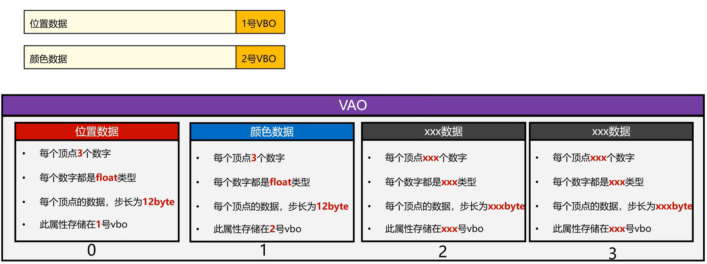

当三角形的位置数据和颜色数据放到同一个VBO中时，我们需要使用VAO来描述这个VBO的结构。
```c
float vertices[] = {
    //位置数据          //颜色数据
    -0.5f, -0.5f, 0.0f, 1.0f, 0.0f, 0.0f,	//左下角
    0.5f, -0.5f, 0.0f, 0.0f, 1.0f, 0.0f,	//右下角
    0.0f,  0.5f, 0.0f, 0.0f, 0.0f, 1.0f	//顶部
}; 
```
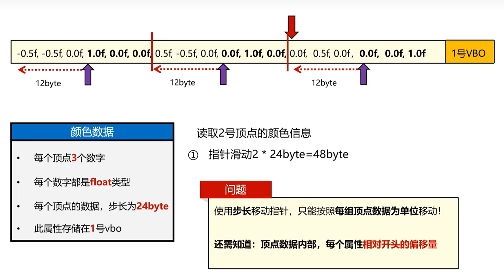