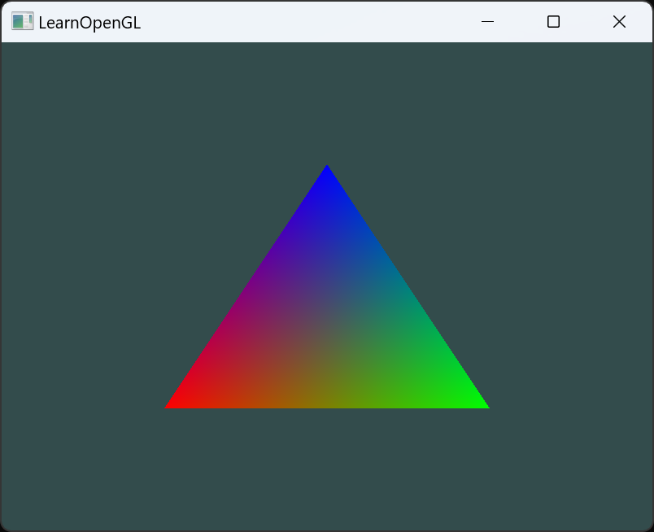

1. Shader类的编写
2. 实现Shader内容的编译链接
3. 实现Shader查错的函数

# Shader.h
```c++
#pragma once

#include "core.h"
#include <string>

class Shader
{
public:
	Shader(const char* vertexPath,const char* fragmentPath);
	~Shader();

	void begin();	//开始使用当前的Shader
	void end();		//结束使用当前Shader

private:
	//检查Shader编译链接错误
	//Targetshader: 目标Shader
	//type: COMPILE LINK
	void checkShaderErrors(GLuint Targetshader, std::string type);

private:
	GLuint m_shaderProgram = 0;
	GLuint m_vao = 0;
};

```

# Shader.cpp
```c++
#include "shader.h"
#include "shader.h"
#include "../wrapper/checkError.h"

#include<string>
#include<fstream>
#include<sstream>
#include<iostream>

Shader::Shader(const char* vertexPath, const char* fragmentPath)
{
	// 准备Shader代码，从文件中读取Shader代码
	// 从文件中读取Shader代码
	std::string vertexCode;
	std::string fragmentCode;
	
	std::ifstream vShaderFile;
	std::ifstream fShaderFile;

	//确保文件流对象可以抛出异常,文件读取失败和文件流异常，都会抛出异常
	vShaderFile.exceptions(std::ifstream::failbit | std::ifstream::badbit);
	fShaderFile.exceptions(std::ifstream::failbit | std::ifstream::badbit);
	try
	{
		//打开文件
		vShaderFile.open(vertexPath);
		fShaderFile.open(fragmentPath);

		//将文件流输入到为字符串流中
		std::stringstream vShaderStream, fShaderStream;
		vShaderStream << vShaderFile.rdbuf();
		fShaderStream << fShaderFile.rdbuf();
	
		//关闭文件
		vShaderFile.close();
		fShaderFile.close();
	
		//将字符串流转换为字符串
		vertexCode = vShaderStream.str();
		fragmentCode = fShaderStream.str();
	}
	catch (std::ifstream::failure& e)
	{
		std::cout << "ERROR::SHADER::FILE_NOT_SUCCESFULLY_READ --" <<e.what() << std::endl;
	}

	//将字符串转换为C风格字符串
	const char* vertexShaderSource = vertexCode.c_str();
	const char* fragmentShaderSource = fragmentCode.c_str();

/*
***********************************************************************************
*/
	//准备Shader程序

	//1.创建Shader程序
	GLuint vertexShader, fragmentShader;
	vertexShader = glCreateShader(GL_VERTEX_SHADER);
	fragmentShader = glCreateShader(GL_FRAGMENT_SHADER);

	//2. 为Shader程序输入Shader代码
	GL_CALL(glShaderSource(vertexShader, 1, &vertexShaderSource, NULL));
	GL_CALL(glShaderSource(fragmentShader, 1, &fragmentShaderSource, NULL));

	//3. 编译并查看是否正确编译
	GL_CALL(glCompileShader(vertexShader));
	checkShaderErrors(vertexShader, "COMPILE");

	GL_CALL(glCompileShader(fragmentShader));
	checkShaderErrors(fragmentShader, "COMPILE");

	//4. 创建一个Program壳子
	m_shaderProgram = glCreateProgram();

	//5. 将vs和fs附加到Program上
	GL_CALL(glAttachShader(m_shaderProgram, vertexShader));
	GL_CALL(glAttachShader(m_shaderProgram, fragmentShader));

	//6. 执行Program，形成最终的Shader程序
	GL_CALL(glLinkProgram(m_shaderProgram));
	//检查链接结果
	checkShaderErrors(m_shaderProgram, "LINK");

	//7. 清理，删除vs和fs
	GL_CALL(glDeleteShader(vertexShader));
	GL_CALL(glDeleteShader(fragmentShader));
}

Shader::~Shader()
{

}

void Shader::begin()
{
	GL_CALL(glUseProgram(m_shaderProgram));
}

void Shader::end()
{
	GL_CALL(glUseProgram(0));
}

void Shader::checkShaderErrors(GLuint Targetshader, std::string type)
{
	if (type == "COMPILE")
	{
		int success;
		char infoLog[512];
		GL_CALL(glGetShaderiv(Targetshader, GL_COMPILE_STATUS, &success));
		if (!success)
		{
			GL_CALL(glGetShaderInfoLog(Targetshader, 512, NULL, infoLog));
			std::cout << "ERROR::SHADER::VERTEX::COMPILATION_FAILED\n" << infoLog << std::endl;
		}
	}
	else if (type == "LINK")
	{
		int success;
		char infoLog[512];
		GL_CALL(glGetProgramiv(Targetshader, GL_LINK_STATUS, &success));
		if (!success)
		{
			GL_CALL(glGetProgramInfoLog(Targetshader, 512, NULL, infoLog));
			std::cout << "ERROR::SHADER::PROGRAM::LINK_FAILED\n" << infoLog << std::endl;
		}
	}
	else
	{
		std::cout << "ERROR::SHADER::UNKNOWN_TYPE" << std::endl;
	}
}
```

```c++
void render()
{
	//先清空颜色缓冲
	GL_CALL(glClear(GL_COLOR_BUFFER_BIT));

	//绑定Shader程序
	shader->begin();
	//绑定vao
	GL_CALL(glBindVertexArray(vao));

	//发出绘制指令
	GL_CALL(glDrawElements(GL_TRIANGLES, 3, GL_UNSIGNED_INT, 0));

	//解绑vao	
	GL_CALL(glBindVertexArray(0));
	//解绑Shader程序
	shader->end();
}
```


