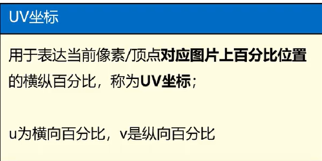
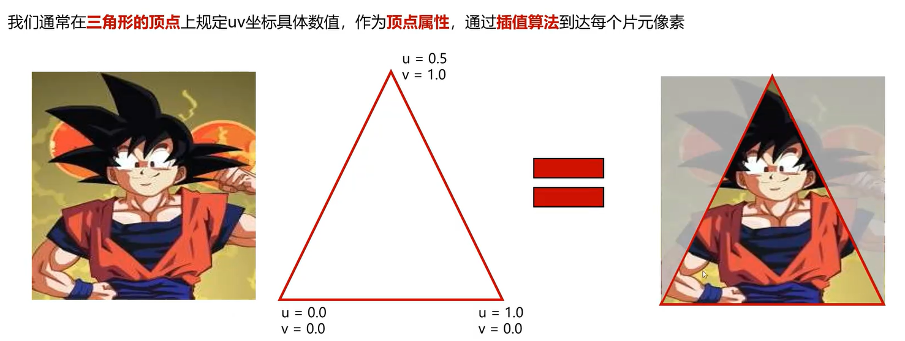
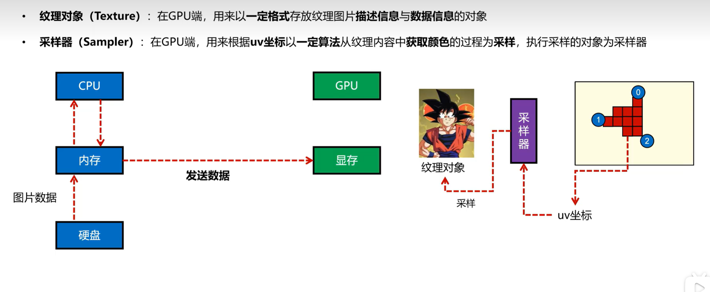
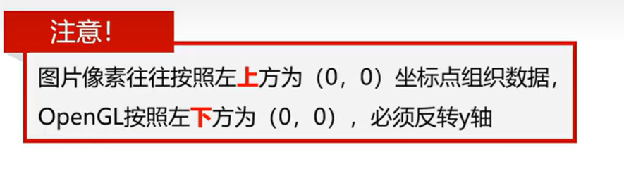
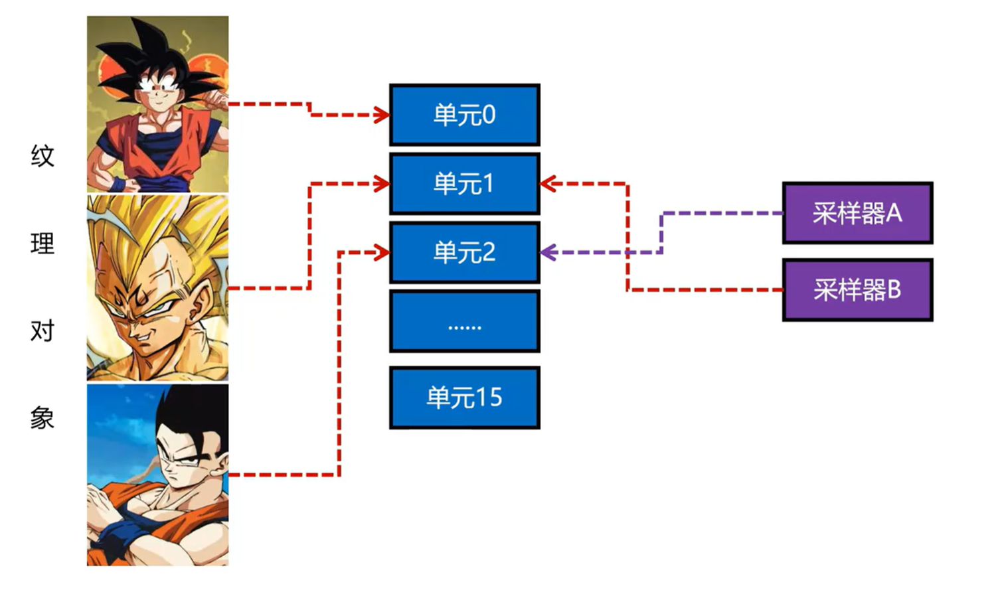
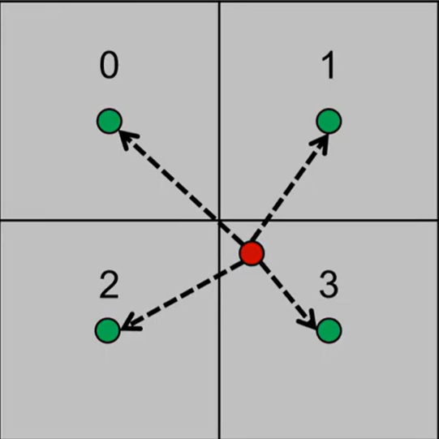
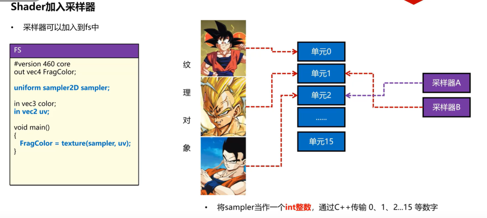
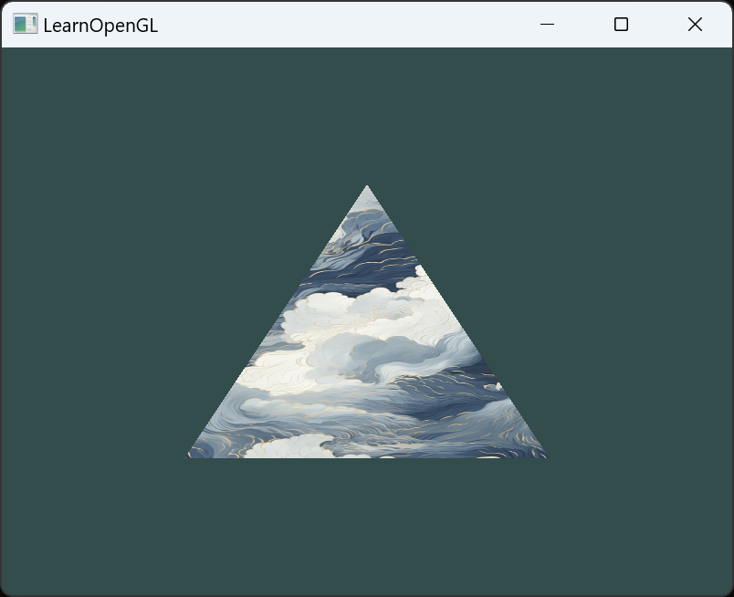
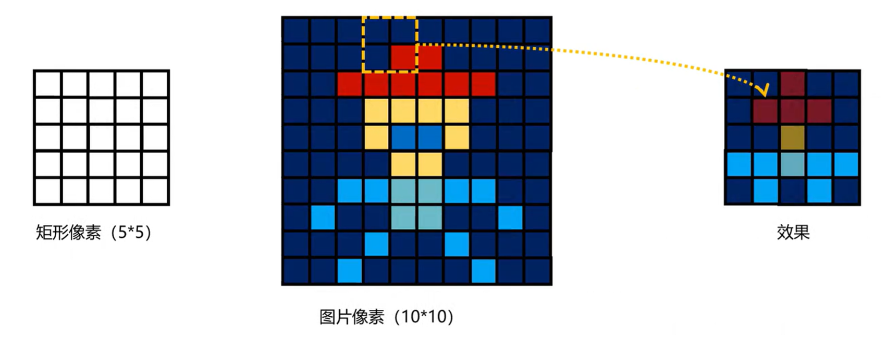

[toc]


# uv坐标
- 为什么需要uv坐标
   当图片像素坐标与顶点坐标不一致时，需要uv坐标来对应图片的像素坐标
    将普通的像素对应改为比例对应，复用一些图片像素
    使用图像的 横向u% 和 纵向v% 来表示一个点的位置
    

    


# 纹理与采样
 - 纹理对象(Texture):在GPU端，用来以一定格式存放纹理图片描述信息与数据信息的对象
 - 采样器(Sampler):在GPU端，用来根据uv坐标以一定算法从纹理内容中获取颜色的工程叫采用，执行采样的对象叫采样器
 


 # 读取纹理图片
    - 使用stb_image.h库读取图片
    `stbi_uc* stbi_load(const char *filename, int *x, int *y, int *comp, int req_comp);`
    - 参数
        - filename:图片路径
        - x:图片的宽度
        - y:图片的高度
        - comp:读入图片的通道种类(RGB\RGBA\灰度图等)
        - req_comp:读出来的数据格式（RGB\RGBA\灰度图等）


 
 `stbi_set_flip_vertically_on_load(true);`  //翻转图片,因为opengl的坐标系与图片的坐标系不一致,设为true,图片的坐标系与opengl的坐标系一致--左下角为原点

# 纹理单元
- 用于链接采样器（Sampler）与纹理对象（Texture），让Sampler知道去哪个纹理对象采样


# 创建纹理对象
`void glGenTextures(GLsizei n, GLuint *textures);`
- 参数
    - n:创建纹理对象的个数
    - textures:存放纹理对象的数组
# 激活纹理单元
`void glActiveTexture(GLenum texture);`
- 参数
    - texture:纹理单元的编号
# 绑定纹理对象
`void glBindTexture(GLenum target, GLuint texture);`
- 参数
    - target:纹理对象的类型
    - texture:纹理对象的编号
# 设置纹理对象的属性
`void glTexParameteri(GLenum target, GLenum pname, GLint param);`
- 参数
    - target:纹理对象的类型
    - pname:纹理对象的属性
    - param:纹理对象的属性值
# 生成纹理
`void glTexImage2D(GLenum target, GLint level, GLint internalformat, GLsizei width, GLsizei height, GLint border, GLenum format, GLenum type, const void *data);`
- 参数
    - target:纹理对象的类型
    - level:多级渐远纹理的级别
    - internalformat:纹理对象的颜色组件
    - width:纹理对象的宽度
    - height:纹理对象的高度
    - border:纹理对象的边框
    - format:纹理对象的数据格式
    - type:纹理对象的数据类型
    - data:纹理对象的数据
---
# 纹理过滤
    当绘制的像素数目大于或者小于纹理的像素数目时，我们就需要过滤来解决这个问题。OpenGL给我们提供了一些选项，我们可以用来设置过滤方式。这些选项可以用来设置纹理放大和缩小时的过滤方式。
    - 1.当要绘制的像素大于纹理像素时，OpenGL该如何采样
        - 临近过滤：根据uv计算出来的小数坐标，取最近整数，得到像素。但这种方式会导致放大后的图片像素块状，导致像素感很强
        - 双线性插值过滤：根据uv计算出来的小数坐标，取最近的四个像素，然后根据距离加权平均得到像素。这种方式会导致放大后的图片像素块状感减弱，但是还是会有些颗粒感
        
    `glTexParameteri(GL_TEXTURE_2D, GL_TEXTURE_MIN_FILTER, GL_NEAREST);`
     -参数
        - GL_TEXTURE_MIN_FILTER:纹理缩小时的过滤方式
        - GL_NEAREST:临近过滤
        - GL_LINEAR:双线性插值过滤

---
# 纹理包裹（Wrapping）
 - Repeat：当UV坐标超过1.0时，会重复纹理
 - Mirrored Repeat：和Repeat一样，但是重复的时候会翻转图片
 - Clamp to Edge：坐标超过1.0时，会对纹理边缘的颜色进行采样复用
 - Clamp to Border：坐标超过1.0时，会对超出的部分设置某一种颜色进行填充

    `glTexParameteri(GL_TEXTURE_2D, GL_TEXTURE_WRAP_S, GL_REPEAT);`

    `glTexParameteri(GL_TEXTURE_2D, GL_TEXTURE_WRAP_T, GL_REPEAT);`
    - 参数
        - GL_TEXTURE_2D :纹理对象的类型
        - GL_TEXTURE_WRAP_S:纹理水平方向的包裹方式
        - GL_TEXTURE_WRAP_T:纹理垂直方向的包裹方式
        - GL_REPEAT:重复
        - GL_MIRRORED_REPEAT:镜像重复
        - GL_CLAMP_TO_EDGE:边缘拉伸
        - GL_CLAMP_TO_BORDER:边缘填充

# 采样器
 - UV数据加入
 ```cpp
 float uvs[] = {
    0.0f, 0.0f, 
    1.0f, 0.0f, 
    1.0f, 1.0f, 
    0.0f, 1.0f  
 }
```
 - Shader 加入UV属性
    -在vs中加入UV属性，并传给fs

# Shader加入采样器
- 在fs中加入采样器
- 采样器的类型是sampler2D



```cpp
#version 460 core
layout(location = 0) in vec3 aPos;
layout(location = 1) in vec3 aColor;
layout(location = 2) in vec2 aUV;

uniform float time;
uniform float speed;

out vec3 ourColor;
out vec2 uv;

void main()
{
	gl_Position = vec4(aPos.x+sin(speed*time)/2.0,aPos.yz, 1.0);
	ourColor = aColor;
	uv = aUV;
}

```
```cpp
#version 460 core
out vec4 FragColor;

uniform float time;
uniform vec3 uColor;

uniform sampler2D sampler;

in vec3 ourColor;
in vec2 uv;

void main()
{
	//float intensity = (sin(time)+1.0f)/2.0f;	//光照
	//FragColor = vec4(uColor+intensity, 1.0f);
	FragColor = texture(sampler, uv);

}
```




# 纹理混合
- 纹理混合
    - 两张纹理混合
    - 两张纹理按照一定比例混合
    - 获取两张纹理在uv坐标下的颜色，然后按照一定比例混合
    - 可以噪声图（一种灰度图，或者一种颜色图），用噪声图的颜色值来控制两张纹理的混合比例
          

# Mipmap（多级渐远纹理）
- 问题：
    当物体距离我们镜头越来越远的时候，占用的像素也会越来越少
    贴图像素数量不变，造成信息浪费
    只使用部分贴图信息，导致画面毛刺增多，表达错误
    图片太大，物体太小，带宽浪费

    双线性插值过滤：根据uv计算出来的小数坐标，取最近的四个像素，然后根据距离加权平均得到像素。这种方式会导致放大后的图片像素块状感减弱，但是还是会有些颗粒感
    

    摩尔纹现象：当纹理贴图的像素数量远远大于物体的像素数量时，会出现摩尔纹现象
- 如何通过原始图片产生多级MipMap

- 如何判断当前物体要使用哪一级别的MipMap

- OpenGL如何使用MipMap