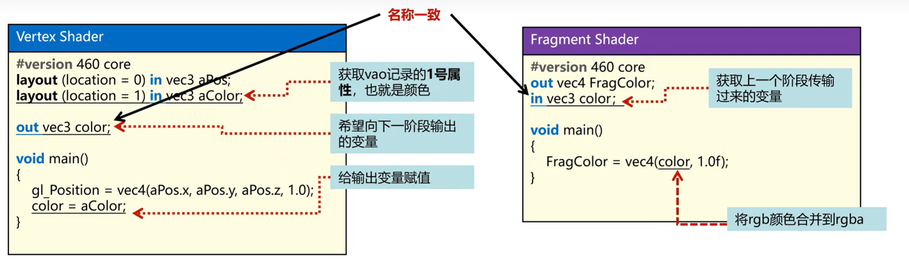
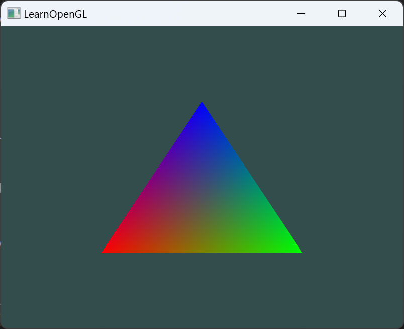
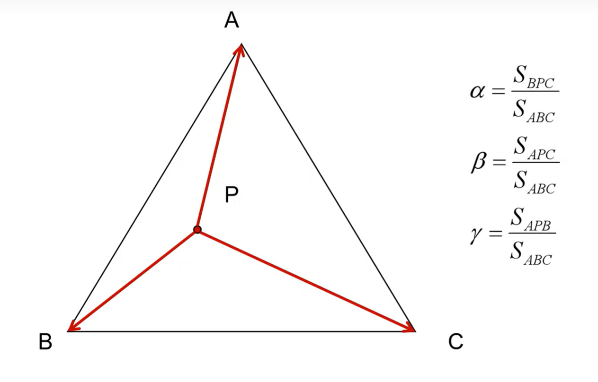
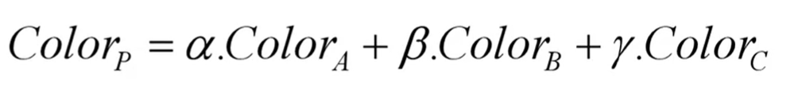
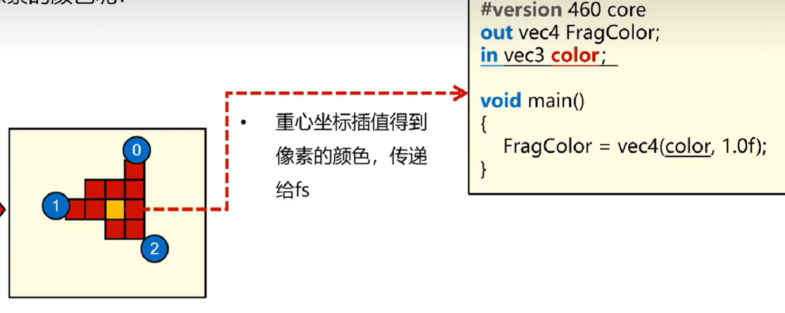

# 彩色三角形



VertexShader 
```glsl
#version 460 core
layout(location = 0) in vec3 aPos;
layout(location = 1) in vec3 aColor;

out vec3 ourColor;

void main()
{
    gl_Position = vec4(aPos, 1.0);
    ourColor = aColor;
}
```
`layout(location = 1) in vec3 aColor;`：指定了顶点属性的颜色，这样在后面的代码中就可以使用`layout(location = 1)`来指定这个属性。
`out vec3 ourColor;`：输出颜色数据，传递给片段着色器。

FragmentShader
```glsl
#version 460 core
out vec4 FragColor;

in vec3 ourColor;

void main()
{
    FragColor = vec4(ourColor, 1.0);
}
```


```c
//1.准备顶点着色器与片段着色器
	const char* vertexShaderSource = R"(
		#version 460 core
		layout(location = 0) in vec3 aPos;
		layout(location = 1) in vec3 aColor;

		out vec3 ourColor;

		void main()
		{
			gl_Position = vec4(aPos, 1.0);
			ourColor = aColor;
		}
	)";

	const char* fragmentShaderSource = R"(
		#version 460 core
		out vec4 FragColor;

		in vec3 ourColor;
		void main()
		{
			FragColor = vec4(ourColor, 1.0f);
		}
	)";
```


# 分析
## 为什么我们只给出了三个顶点的颜色，但是整个三角形都被填充了颜色？

因为OpenGL会在三角形的三个顶点上进行插值，然后在三角形的每个片段上进行插值。这个过程叫做**颜色混合**。

- 重心插值算法
    
    

- 各个像素点的颜色通过重心插值算法计算得到
    