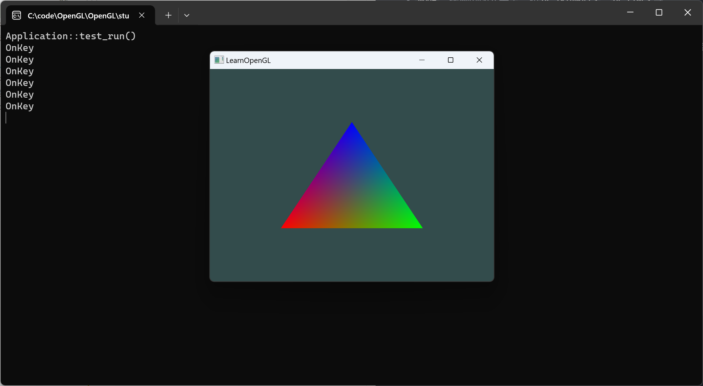
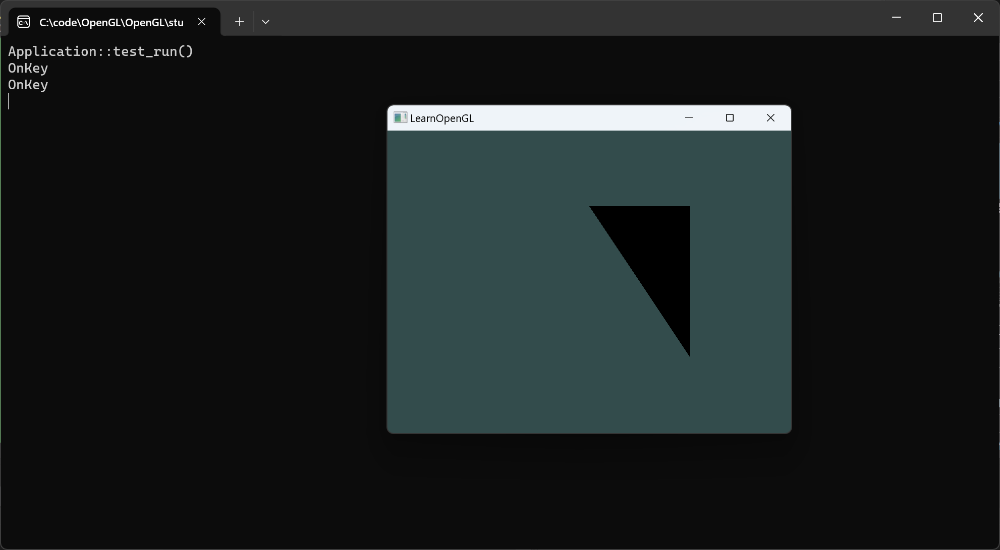
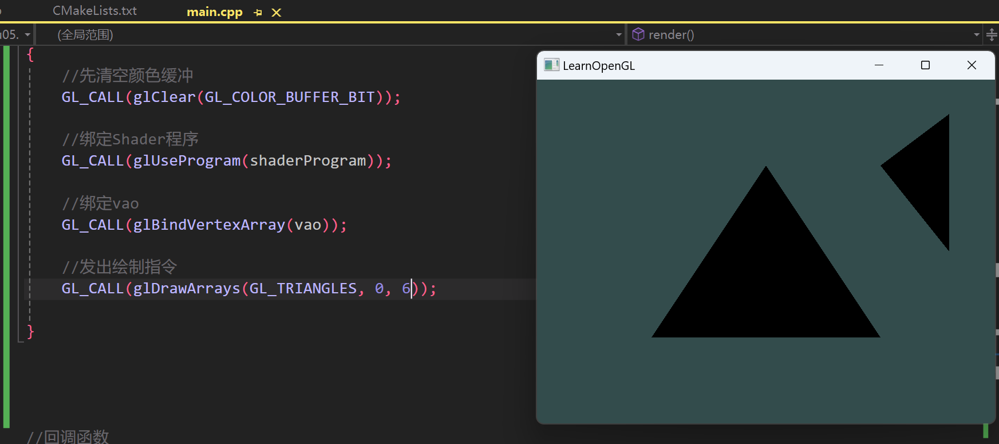
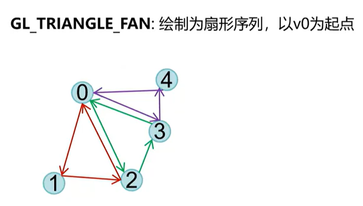
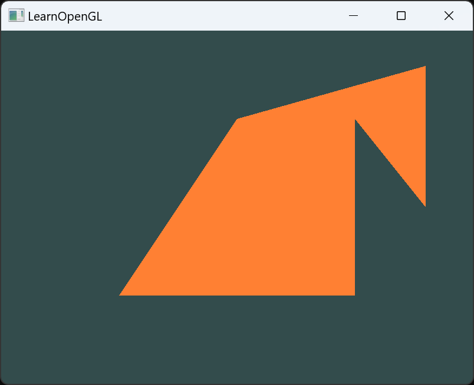
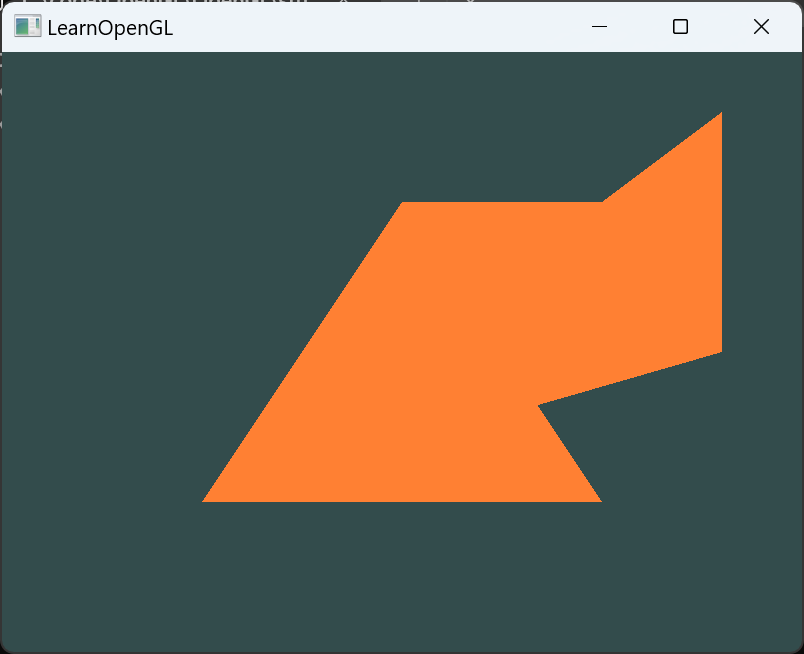
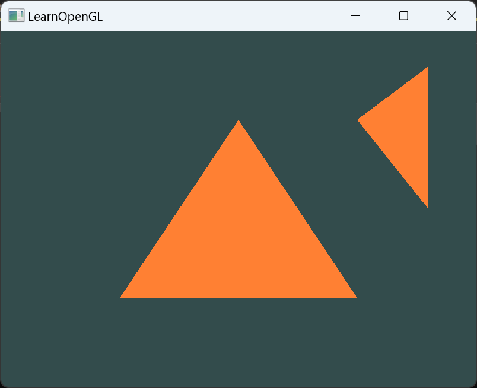
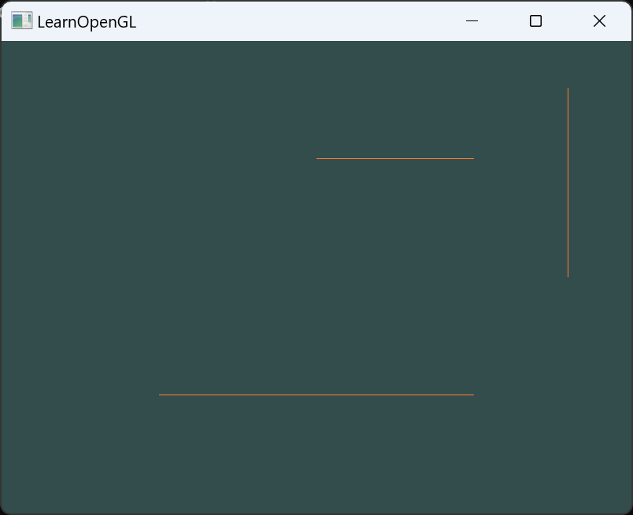
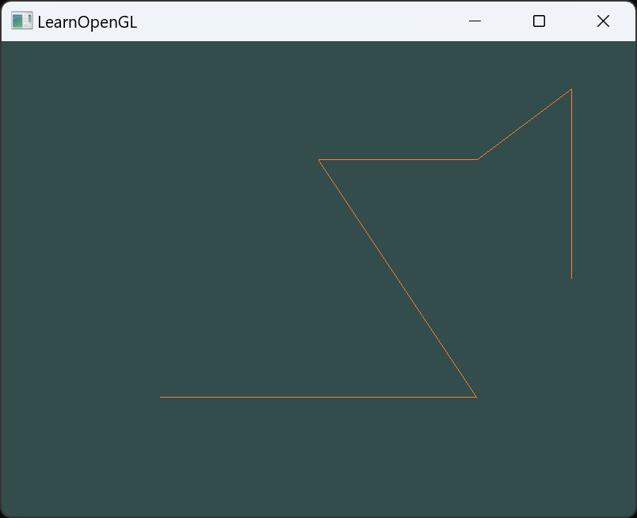
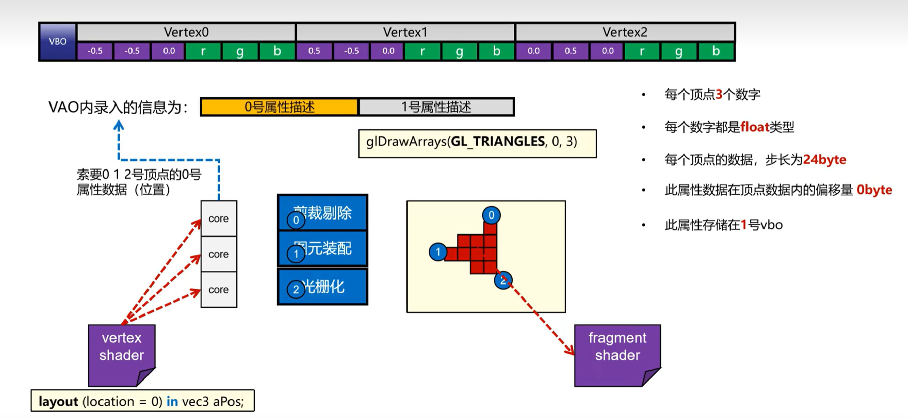

# 绘制流程
- 已经准备好了几何数据与材质数据，接下来就是绘制的流程了。
接下来需要告诉GPU使用我们提供的几何数据和材质数据进行绘制。

## 1. glUseProgram
- 首先，我们需要告诉OpenGL使用哪个Shader程序，这里使用`glUseProgram`函数。
```c
void useShaderProgram(GLuint program)
{
    GL_CALL(glUseProgram(program));
}
``` 

## 2. 绑定VAO
- 接下来，我们需要告诉OpenGL使用哪个VAO，这里使用`glBindVertexArray`函数。
```c
void bindVAO(GLuint vao)
{
    GL_CALL(glBindVertexArray(vao));
}
```

## 3. 绘制
- 最后，我们使用`glDrawArrays`函数进行绘制。
```c
void drawArrays(GLenum mode, GLint first, GLsizei count)
{
    GL_CALL(glDrawArrays(mode, first, count));
}
```
- `mode`：绘制的图元类型，如`GL_TRIANGLES`、`GL_LINES`等。
- `first`：从哪个顶点开始绘制。
- `count`：绘制的顶点个数。
==注意：== 在绘制之前，需要确保已经绑定了VAO，否则绘制的时候会出现错误，绘制三角形需要3个顶点，绘制直线需要2个顶点。


```c
void render()
{
	//先清空颜色缓冲
	GL_CALL(glClear(GL_COLOR_BUFFER_BIT));

	//绑定Shader程序
	GL_CALL(glUseProgram(shaderProgram));

	//绑定vao
	GL_CALL(glBindVertexArray(vao));

	//发出绘制指令
	GL_CALL(glDrawArrays(GL_TRIANGLES, 0, 3));

}
```



## 4. 多顶点数据


```
void perpareVAOForGLTriangle()
{
	//1.准备positions
	float positions[] = {
		-0.5f, -0.5f, 0.0f,	//左下角
		0.5f, -0.5f, 0.0f,	//右下角
		0.0f,  0.5f, 0.0f,	//顶部
		0.5f,  0.5f, 0.0f	//右上角
	};

	//2.准备VBO
	GLuint positionsVBO = 0;
	GL_CALL(glGenBuffers(1, &positionsVBO));
	GL_CALL(glBindBuffer(GL_ARRAY_BUFFER, positionsVBO));
	GL_CALL(glBufferData(GL_ARRAY_BUFFER, sizeof(positions), positions, GL_STATIC_DRAW));

	//3.准备VAO
	GL_CALL(glGenVertexArrays(1, &vao));
	GL_CALL(glBindVertexArray(vao));

	//4.描述位置属性
	GL_CALL(glBindBuffer(GL_ARRAY_BUFFER, positionsVBO));
	GL_CALL(glEnableVertexAttribArray(0));	//启用VAO的零号顶点属性位置
	GL_CALL(glVertexAttribPointer(0, 3, GL_FLOAT, GL_FALSE, 3 * sizeof(float), (void*)0));	//设置顶点属性指针

	//5.解绑VAO
	GL_CALL(glBindVertexArray(0));
}
```

`GL_CALL(glDrawArrays(GL_TRIANGLES, 1, 4));`



绘制6个点
```c
//1.准备positions
float positions[] = {
	-0.5f, -0.5f, 0.0f,	
	0.5f, -0.5f, 0.0f,	
	0.0f,  0.5f, 0.0f,	
	0.5f,  0.5f, 0.0f,	
	0.8f, 0.8f, 0.0f,
	0.8f, 0.0f, 0.0f,
};
```



---
## 5. 绘制命令中的模式
- `glDrawArrays`函数的第一个参数是绘制的图元类型，如`GL_TRIANGLES`、`GL_LINES`等。
- `GL_TRIANGLES`：绘制三角形。
- `GL_LINES`：绘制直线。
- `GL_POINTS`：绘制点。
- `GL_LINE_STRIP`：绘制折线。
- `GL_LINE_LOOP`：绘制闭合折线。
- `GL_TRIANGLE_STRIP`：绘制三角形带,会共用顶点。
    - 遵循以下规则
        -（1）如果末尾序号n为偶数，则绘制三角形（n-2,n-1,n）。
        -（2）如果末尾序号n为奇数，则绘制三角形（n-1,n-2,n）。
        目的是为了保证三角形的顺序是逆时针的。
- `GL_TRIANGLE_FAN`：绘制三角形扇。
            - 

#### 测试Triangle的三种mode

`GL_CALL(glDrawArrays(GL_TRIANGLE_STRIP, 0, 6));`


`GL_CALL(glDrawArrays(GL_TRIANGLE_FAN, 0, 6));`


`GL_CALL(glDrawArrays(GL_TRIANGLES, 0, 6));`



#### 测试Line的二种mode

`GL_CALL(glDrawArrays(GL_LINES, 0, 6));`


`GL_CALL(glDrawArrays(GL_LINE_STRIP, 0, 6));`



## 6. 总结绘制流程
- 绘制流程总结如下：
    - 使用`glUseProgram`函数告诉OpenGL使用哪个Shader程序。
    - 使用`glBindVertexArray`函数告诉OpenGL使用哪个VAO。
    - 使用`glDrawArrays`函数进行绘制。
    
